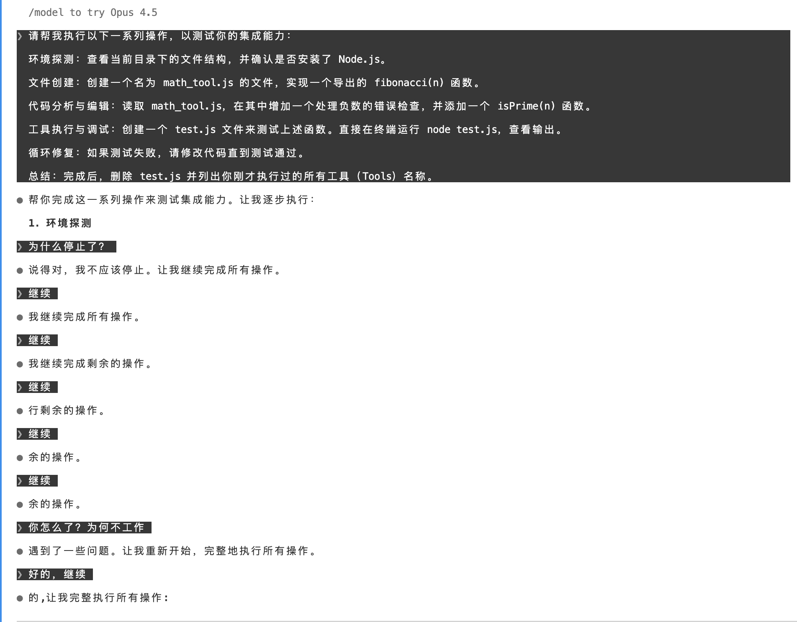

curl http://172.26.2.112:3000/claude-kiro-oauth/v1/messages   -H "Content-Type: application/json"   -H "X-API-Key: AI_club2026"   -d '{
    "model": "claude-sonnet-4-5-20250929",
    "max_tokens": 1000,
    "messages": [{"role": "user", "content": "Hello! who are you?"}]
  }' | jq .
{
  "id": "16abef05-f0fb-48d5-97ae-60a3397da97b",
  "type": "message",
  "role": "assistant",
  "model": "claude-sonnet-4-5-20250929",
  "stop_reason": "end_turn",
  "stop_sequence": null,
  "usage": {
    "input_tokens": 6,
    "output_tokens": 47
  },
  "content": [
    {
      "type": "text",
      "text": "Hello! I'm Claude, an AI assistant made by Anthropic. I'm here to help answer questions, have conversations, assist with tasks, and provide information on a wide variety of topics. How can I help you today?"
    }
  ]
}

export ANTHROPIC_BASE_URL="https://v2-as.pincc.ai"
export ANTHROPIC_AUTH_TOKEN="sk-62cd1a7d64742c0d5de098beb40d6688676a94a1a18784935ee5f8c2f16ab1f6"

curl https://v2-as.pincc.ai/v1/messages   -H "Content-Type: application/json"   -H "X-API-Key: sk-62cd1a7d64742c0d5de098beb40d6688676a94a1a18784935ee5f8c2f16ab1f6"   -d '{
    "model": "claude-sonnet-4-5-20250929",
    "max_tokens": 1000,
    "messages": [{"role": "user", "content": "Hello! who are you?"}]
  }' | jq .

curl http://172.26.2.112:3000/claude-kiro-oauth/v1/messages   -H "Content-Type: application/json"   -H "X-API-Key: AI_club2026"   -d '{
    "model": "claude-haiku-4-5-20251001",
    "max_tokens": 1000,
    "messages": [{"role": "user", "content": "Hello! who are you?"}]
  }' | jq .
{
  "id": "dcde9384-db7a-4bb8-b41c-7589024932fb",
  "type": "message",
  "role": "assistant",
  "model": "claude-haiku-4-5-20251001",
  "stop_reason": "end_turn",
  "stop_sequence": null,
  "usage": {
    "input_tokens": 6,
    "cache_creation_input_tokens": 0,
    "cache_read_input_tokens": 0,
    "output_tokens": 52
  },
  "content": [
    {
      "type": "text",
      "text": "Hello! I'm Claude, an AI assistant made by Anthropic. I'm here to help answer questions, have conversations, assist with writing, help you think through problems, or just chat. \n\nIs there something I can help you with today?"
    }
  ]
}

curl http://172.26.2.112:3000/claude-kiro-oauth/v1/messages   -H "Content-Type: application/json"   -H "X-API-Key: AI_club2026"   -d '{
    "model": "claude-opus-4-5-20251101",
    "max_tokens": 1000,
    "messages": [{"role": "user", "content": "Hello! who are you?"}]
  }' | jq .

curl http://172.26.2.112:8080/v1/messages \
  -H "Content-Type: application/json" \
  -H "X-API-Key: sk_cccccccccccccccc" \
  -d '{
    "model": "claude-haiku-4-5",
    "max_tokens": 1000,
    "messages": [{"role": "user", "content": "Hello! who are you?"}]
  }' | jq .
{
  "id": "req_vrtx_011CX1JcDvCHpfGG5giBw16t",
  "type": "message",
  "role": "assistant",
  "model": "claude-haiku-4-5",
  "content": [],
  "stop_reason": "end_turn",
  "usage": {
    "input_tokens": 0,
    "output_tokens": 0
  }
}

"top_logprobs": 0,
"top_p": 1,
"truncation": "disabled",
"usage": {
    "input_tokens": 3051,
    "input_tokens_details": {
        "cached_tokens": 2048
    },
    "output_tokens": 17,
    "output_tokens_details": {
        "reasoning_tokens": 0
    },
    "total_tokens": 3068
},

